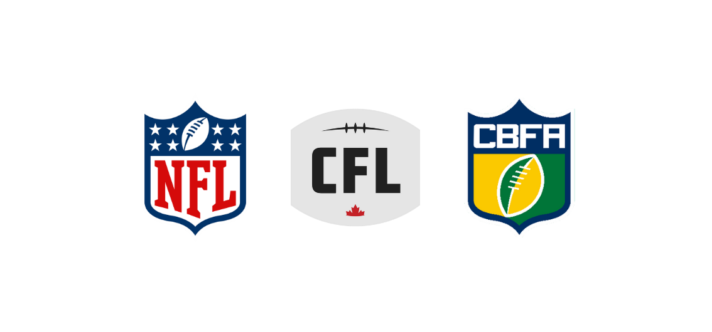

## 🏈 Alan | American Football 🏈

O futebol americano é extremamente popular nos Estados Unidos. Nos anos 90, ultrapassou até mesmo o baseball como o esporte mais popular da nação. Recentemente tem conquistado fãs em todo o mundo, e é uma modalidade de certa forma recente no Brasil, e tem crescido de forma significativa no número de fãs, público e jogadores. O meu objetivo é fazer que ainda mais pessoas conheçam e acompanhem o esporte no Brasil.

## Documentação

[Documentação](doc/docFootball.pdf)

## Stack utilizada

**Front-end:**``

**Back-end:** `` ``

## Autor

- [@](https://www.github.com/alanaquinoslv)
